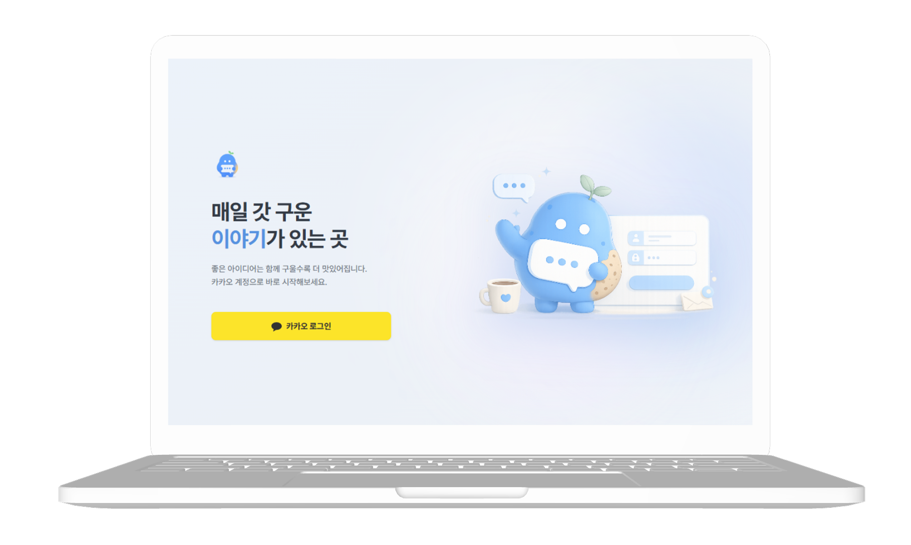
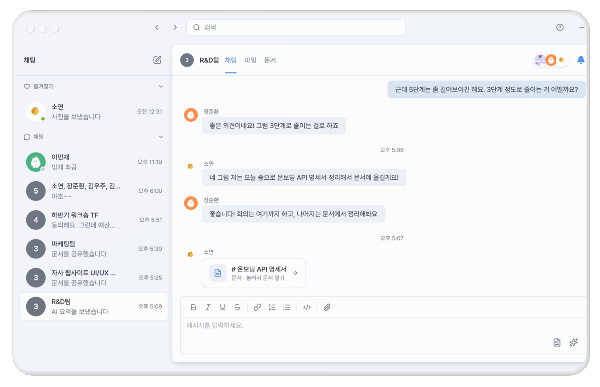
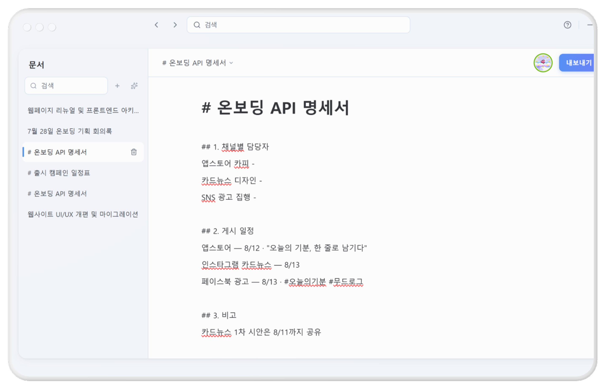
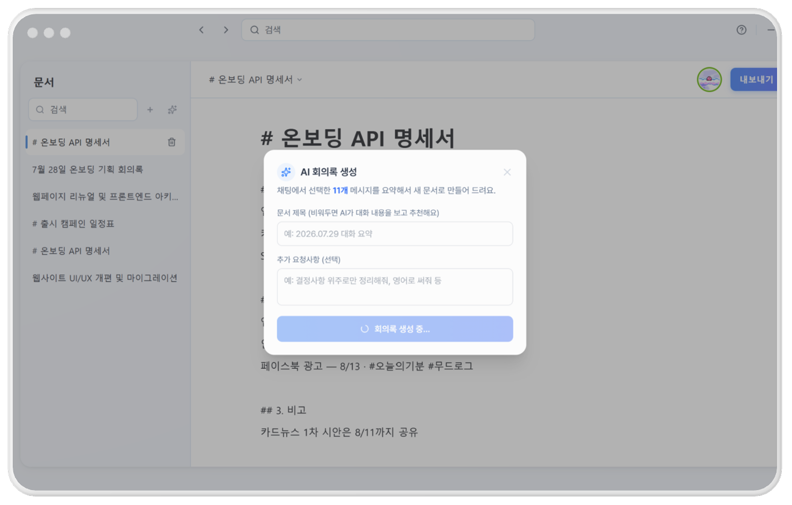
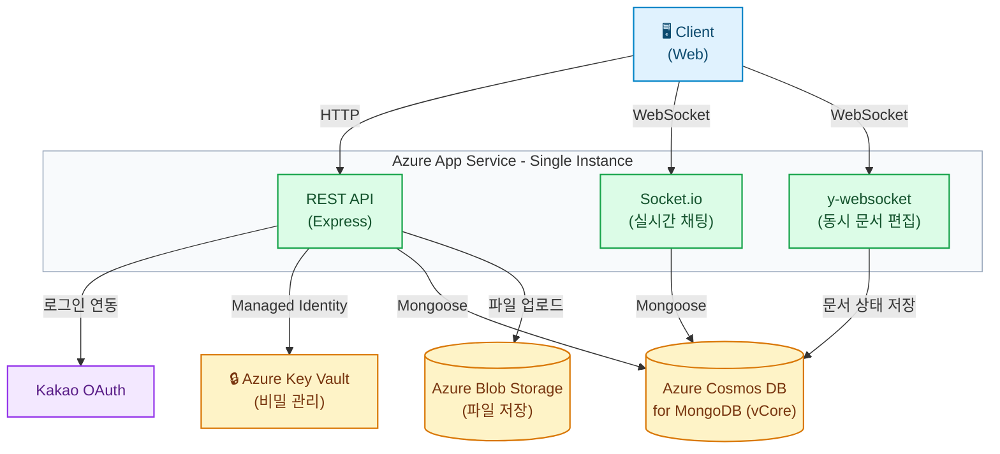
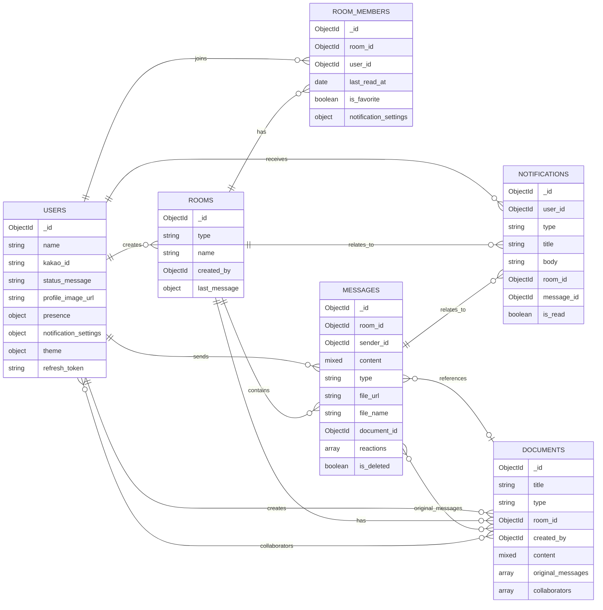

<p align="center">
  
</p>

<h1 align="center">GOOUM (구움) — Backend</h1>

<p align="center">
  대화를 나누고, 협업하며, 결과물을 함께 구워내는 공간
</p>

<p align="center">
  
  
  
  
  
  
  
</p>


<p align="center">
  이 저장소는 <b>구움(Gooum)의 백엔드</b>입니다. 프론트엔드 저장소는 <a href="https://github.com/ureca-Gooum/Gooum-FE">Gooum-FE</a>를 참고하세요.
</p>

<p align="center">
  <a href="https://gooum-green.vercel.app/">🌐 배포 사이트</a>
  ·
  <a href="https://app-gooum-backend.azurewebsites.net">📑 Swagger 문서</a>
  ·
  <a href="https://app.notion.com/p/uplusureca-4/API-39db1b3b865680398783e4853bef447e?source=copy_link">📝 Notion API 명세</a>
  ·
  <a href="https://app.notion.com/p/uplusureca-4/DB-ERD-39cb1b3b865680619006de2a0d4c75bb?source=copy_link">🗂️ Notion DB 명세</a>
</p> <br><br>
  
  
# 1. 프로젝트 소개

**GOOUM**은 팀명인 **구운감자**의 '구움'과, 사람들이 모여 대화하고 협업하는 공간을 뜻하는 **Room**을 결합한 이름입니다.

### 문제 인식

해커톤 팀, 사이드 프로젝트, 프리랜서 협업, 대학 팀플처럼 같은 회사나 조직에 속하지 않은 사람들이 함께 일할 때, 현실은 보통 이렇습니다.

> 카카오톡으로 대화하고 → 구글 독스에서 문서를 쓰고 → 노션에 일정을 정리하고 → 회의록은 누군가 수기로 남긴다

소통과 협업이 3~4개의 도구로 흩어지면서, 대화와 결과물이 따로 놀게 됩니다. Slack이나 Teams 같은 워크스페이스 기반 도구는 "같은 조직"을 전제하기 때문에, 소속이 다른 사람들끼리는 애초에 쓰기 어렵습니다.

### 해결

**구움(Gooum)은 소속이나 조직에 관계없이 누구와도 바로 협업을 시작할 수 있는 AI 기반 협업 메신저입니다.** 워크스페이스 가입이나 조직 초대 없이, 계정만 만들면 상대와 바로 대화를 시작할 수 있습니다.

흩어져 있던 **대화 → 협업 → 기록**의 흐름을 하나의 서비스로 연결했습니다. 채팅으로 나눈 논의는 그 자리에서 함께 편집하는 문서가 되고, 회의록은 AI가 자동으로 정리합니다.
<br><br>

# 2. 팀원 소개

<table width="100%" border="1" cellpadding="10" cellspacing="0">
  <colgroup>
    <col width="33.33%"><col width="33.33%"><col width="33.33%">
  </colgroup>
  <tr align="center">
    <td></td>
    <td></td>
    <td></td>
  </tr>
  <tr align="center">
    <td><b>👑 장준환</b></td>
    <td><b>박소연</b></td>
    <td><b>서지현</b></td>
  </tr>
  <tr align="center">
    <td><a href="https://github.com/junhwan0697"></a></td>
    <td><a href="https://github.com/Ppakso"></a></td>
    <td><a href="https://github.com/jhwest-dev"></a></td>
  </tr>
  <tr align="center">
    <td></td>
    <td></td>
    <td></td>
  </tr>
  <tr align="center">
    <td>동시 편집 에디터<br>문서 페이지<br>알림 센터<br>카카오 로그인</td>
    <td>피그마<br>환경 세팅<br>실시간 채팅<br>대화방 목록<br>파일 첨부<br>AI 회의록 생성</td>
    <td>REST API<br>Socket.io 서버<br>MongoDB<br>인증 및 권한<br>파일 저장<br>Azure 배포</td>
  </tr>
</table>
<br><br>

# 3. 핵심 기능

### 1. 실시간 채팅

- 1:1 및 그룹 채팅
- 실시간 메시지 송수신
- @멘션 시 상대방에게 실시간 알림
- 타이핑 중 표시
- 파일 및 이미지 첨부

<p align="center">
  
</p>

### 2. 동시 문서 편집

- 문서 생성 및 수정
- 여러 사용자의 동시 편집
- 변경 사항 실시간 반영

<p align="center">
  
</p>

### 3. AI 회의록 생성

- 채팅 내용을 기반으로 회의록 자동 생성
- 회의 내용 요약
- 생성된 AI 회의록을 동시 편집 가능한 문서로 저장

<p align="center">
  
</p>

### 4. 그 외 협업 편의 기능

- 온라인 상태(프레즌스) 표시
- 채팅방 즐겨찾기
- 실시간 알림 센터 (읽음 처리 포함)
- 통합 검색
<br><br>

# 4. 기술 스택

| 구분 | 기술 |
|---|---|
| 런타임 | Node.js |
| 프레임워크 | Express |
| 언어 | TypeScript |
| 실시간 채팅 | Socket.io |
| 동시 편집 | y-websocket |
| ODM | Mongoose |
| 인증 | JWT (jsonwebtoken) |
| 요청 검증 | Zod |
| API 문서 | Swagger (swagger-jsdoc + swagger-ui-express) |
| 배포 | Azure App Service |
| DB | Azure Cosmos DB for MongoDB (vCore) |
| 파일 저장소 | Azure Blob Storage |
| 비밀 관리 | Azure Key Vault |
<br><br>

# 5. 시스템 아키텍처


<br><br>

# 6. 프로젝트 구조

```
src/
├── api/
│   ├── controllers/        # 요청 처리 + 응답 반환
│   └── routes/             # URL 매핑 + Swagger 문서
├── core/
│   ├── config/             # 환경변수, DNS, Swagger 설정
│   ├── db/                 # MongoDB 연결
│   ├── middlewares/        # 인증, 에러 핸들러
│   └── security/           # JWT 토큰 관리
├── models/                 # Mongoose 스키마
├── schemas/                # Zod 요청/응답 검증
├── services/               # 비즈니스 로직
├── socket/                 # Socket.io + y-websocket 핸들러
├── types/                  # TypeScript 타입 선언
└── server.ts               # 진입점
```
<br><br>

# 7. 시작하기

* **Node.js**: v24.15.0 이상 권장
* **npm**: v11.12.1 이상 권장

### 1. 패키지 설치

```bash
npm install
```

### 2. 환경변수 설정

프로젝트 루트에 `.env` 파일 생성 (`.env.example` 참고):

```
PORT=8000
NODE_ENV=development
KEY_VAULT_URL=
DOCUMENT_DB_CONNECTION_STR=mongodb+srv://...
DOCUMENT_DATABASE_NAME=gooum
JWT_SECRET_KEY=
JWT_ALGORITHM=HS256
ACCESS_TOKEN_EXPIRE_MINUTES=30
REFRESH_TOKEN_EXPIRE_DAYS=7
KAKAO_REST_API_KEY=
KAKAO_CLIENT_SECRET=
KAKAO_REDIRECT_URI=http://localhost:3000/auth/callback
AZURE_STORAGE_CONNECTION_STR=
AZURE_STORAGE_CONTAINER_NAME=uploads
```

### 3. 실행

```bash
npm run dev
```

### 4. API 문서 확인

```
http://localhost:8000/api-docs
```

### 5. 디버깅 (VS Code)

F5 키로 디버그 모드 실행 (`.vscode/launch.json` 설정 포함)
<br><br>


# 8. API 목록

전체 엔드포인트 상세 스펙(요청/응답 스키마 포함)은 [배포 Swagger 문서](https://app-gooum-backend.azurewebsites.net) 또는 로컬 실행 후 `http://localhost:8000/api-docs`에서, 더 자세한 명세는 [Notion API 명세](https://app.notion.com/p/uplusureca-4/API-39db1b3b865680398783e4853bef447e?source=copy_link)에서 확인할 수 있습니다.

| 리소스 | 설명 |
|---|---|
| Auth | 카카오 로그인, 토큰 재발급/로그아웃 |
| Users | 내 프로필 조회/수정, 유저 목록/상세 조회 |
| Rooms | 채팅방 생성/조회/수정/나가기, 즐겨찾기, 멤버 초대 |
| Messages | 메시지 기록 조회, 메시지 삭제 |
| Documents | 문서 생성/조회/자동 저장/삭제 |
| Notifications | 알림 목록 조회, 읽음 처리 |
| Search | 통합 검색 |
| Upload | 파일 업로드 |
<br><br>

# 9. Socket.io 이벤트

### 연결

```typescript
const socket = io("http://localhost:8000", {
    auth: { token: "accessToken" }
});
```

### 이벤트 목록

| 이벤트 | 방향 | 설명 |
|---|---|---|
| joinRoom | Client → Server | 채팅방 입장 |
| leaveRoom | Client → Server | 채팅방 퇴장 |
| sendMessage | Client → Server | 메시지 전송 |
| typing | Client → Server | 타이핑 중 |
| updatePresence | Client → Server | 프레즌스 상태 변경 |
| addReaction | Client → Server | 이모지 리액션 |
| newMessage | Server → Client | 새 메시지 수신 |
| userTyping | Server → Client | 상대방 타이핑 표시 |
| presenceChanged | Server → Client | 상대방 상태 변경 |
| newNotification | Server → Client | 실시간 알림 |
| reactionUpdated | Server → Client | 리액션 업데이트 |
| unreadCount | Server → Client | 안 읽은 알림 수 (연결 시) |
| messageDeleted | Server → Client | 메시지 삭제 알림 |
<br><br>

# 10. DB 컬렉션

더 자세한 DB 명세는 [Notion DB 명세](https://app.notion.com/p/uplusureca-4/DB-ERD-39cb1b3b865680619006de2a0d4c75bb?source=copy_link)를 참고하세요.

### ERD


<br><br>
| 컬렉션 | 용도 |
|---|---|
| users | 사용자 정보 |
| rooms | 채팅방 (1:1 / 그룹) |
| room_members | 채팅방별 유저 정보 (읽은 위치, 즐겨찾기) |
| messages | 채팅 메시지 (텍스트/이미지/파일/문서) |
| documents | 동시 편집 문서 + AI 회의록 |
| notifications | 알림 |
<br><br>

# 11. 배포

Azure App Service에 배포하며, 단일 서버(Single Instance)에서 REST API, Socket.io, y-websocket이 함께 동작합니다.

### Application Settings (Azure Portal)

```
NODE_ENV=production
KEY_VAULT_URL=https://<키볼트이름>.vault.azure.net
```

### 필요 설정

- App Service → ID → 시스템 할당 관리 ID 켜기
- Key Vault → 액세스 정책 → App Service 접근 허용 (Get, List)
